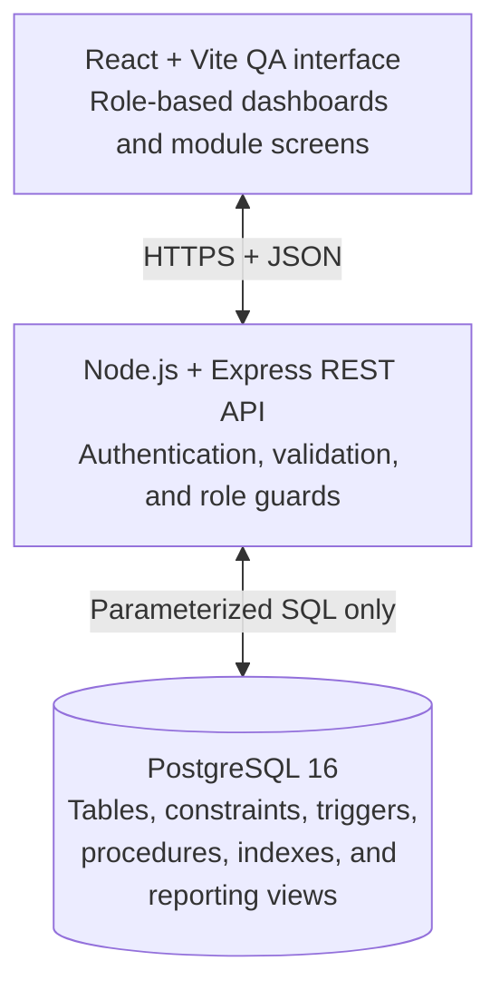

# CATMS

**Clinic Appointment and Treatment Management System**

## Frontend implementation

The Phase 1 staff frontend is now implemented as a responsive React + TypeScript application. It includes role-gated Reception, Clinician, Branch Manager, and Admin/Finance workspaces; a deterministic in-browser demonstration layer exercises the complete journey while the Express API and PostgreSQL schema are still pending.

```bash
cd frontend
npm install
npm run dev
```

Use any of the four role cards on the demonstration login screen. The frontend includes patient registration/search, scheduling and walk-ins, clinical treatment recording, generated invoice views, payments and claims, branch/staff administration, and all five management reports. Run the local checks with:

```bash
cd frontend
npm run lint
npm test
npm run build
```

Copy `frontend/.env.example` to `frontend/.env` when connecting the forthcoming API. No real patient data should be used in demonstration mode.

CATMS is a database-centred system planned for **MedSync Clinics**, a medium-scale, multi-specialty clinic operating in **Colombo, Kandy, and Galle, Sri Lanka**. It will replace disconnected paper records and spreadsheets with a single clinic-wide source of truth for appointments, clinical treatments, billing, payments, and insurance claims.

> **Current status:** Planning and requirements definition. The SRS and delivery plan are complete, but no database schema, API, frontend, migrations, seed data, or deployment configuration has been implemented yet.

## Project vision

Phase 1 will digitise the full operational path from appointment booking to payment:

```text
Register patient -> Book appointment -> Complete consultation
                 -> Record treatments -> Generate invoice
                 -> Take payment / submit claim -> View reports
```

The database—not the UI—will be the authority for rules that must never be broken. PostgreSQL constraints, triggers, transactions, and stored procedures will protect scheduling, treatment, invoicing, and payment integrity even when the application layer is bypassed.

The browser application is therefore a role-based QA and demonstration interface around a carefully designed relational database. The database design and the team's ability to explain and prove it are the primary goals of this course project.

## The problem CATMS solves

MedSync's current paper-and-spreadsheet workflow makes it difficult to maintain consistent records across branches and safely coordinate clinical and financial processes. CATMS is intended to provide:

- one clinic-wide patient record, visible from every branch;
- reliable doctor scheduling with no overlapping appointments;
- traceable rescheduling, cancellation, and status history;
- treatment and consultation recording only after an appointment is completed;
- automatic, reproducible invoice calculations;
- accurate partial-payment, outstanding-balance, and insurance-claim tracking;
- management reports derived directly from current database data; and
- role-based access for reception, clinical, branch-management, finance, and QA work.

## Phase 1 scope

### In scope

- Branch, employee, doctor, and specialty management
- Clinic-wide patient registration and search
- Emergency contacts, insurance providers, policies, and treatment coverage
- Booked, rescheduled, cancelled, and walk-in appointments
- Doctor availability and overlap prevention
- Appointment history and status audit logs
- Consultation notes, diagnoses, and completed treatments
- Treatment catalogue and price-at-treatment snapshots
- Automatic invoice creation and recalculation
- Full and partial payments with overpayment protection
- Internal insurance-claim tracking
- Five management reports
- Role-based QA web interface
- Reproducible realistic demo data

### Out of scope

- A production-grade patient-facing portal
- External insurance-provider integration or electronic claim transmission
- Email, SMS, or medical-device integrations
- Multiple currencies or locales; Phase 1 uses **LKR** with `DECIMAL(10,2)`
- Branch-specific treatment prices
- Production cloud deployment for the course submission

## Users and access

| User class | Primary responsibilities |
| --- | --- |
| Receptionist | Register/search patients; book, reschedule, cancel, and create walk-in appointments |
| Doctor / Clinician | View assigned appointments; record diagnoses, consultation notes, and treatments for completed appointments |
| Branch Manager | Review branch-level operational information, including the daily appointment summary, subject to the final access matrix |
| Admin / Finance | Manage branches/staff, catalogue pricing, payments, claims, billing details, and management reporting |
| QA Tester | Deliberately exercise valid and invalid flows to prove database rules and role restrictions |

The final system will apply defence in depth: each API route will verify the user's role, while database roles and `GRANT`/`REVOKE` privileges will independently restrict data access.

## Planned architecture



The project is intentionally local-first and hand-built. Docker Compose will provide the same PostgreSQL environment on every team member's machine. No ORM or managed backend will generate the schema or hide the database mechanisms being assessed.

### Planned technology stack

| Layer | Planned tools | Purpose |
| --- | --- | --- |
| Database | PostgreSQL 16 | Relational model, ACID transactions, constraints, triggers, procedures, views, and indexes |
| Database access | `node-postgres` (`pg`) | Direct, parameterized SQL without ORM schema generation |
| Backend | Node.js 20 + Express | Thin REST API over database procedures and views |
| Validation and auth | Zod, bcrypt, JWT | Input validation, password hashing, and role-aware sessions |
| Frontend | React + Vite | Browser-based QA and demonstration interface |
| UI libraries | Tailwind CSS, TanStack Query, React Router, Recharts | Shared design system, server-state handling, role routes, and report charts |
| Local environment | Docker Compose + pgAdmin/DBeaver | Reproducible setup, inspection, and database QA |
| Collaboration | GitHub, Projects, Actions, CODEOWNERS | Planning, review, CI, traceability, and ownership |

## Data model plan

The logical design is split into five ownership modules. The planned physical model contains **17 base tables**, **2 pure many-to-many junction tables**, and **5 read-only reporting views/functions**.

| Module | Area | Planned entities / relations |
| --- | --- | --- |
| A | Branch & Staff | `Branch`, `Employee`, `Doctor`, `Specialty`, `Doctor_Specialty` |
| B | Patient & Insurance | `Patient`, `Emergency_Contact`, `Insurance_Provider`, `Insurance_Policy`, `Policy_Coverage` |
| C | Appointment & Scheduling | `Appointment`, `Consultation_Note`, `Appointment_History`, `Appointment_Status_Log` |
| D | Treatment & Billing | `Treatment_Catalogue`, `Appointment_Treatment`, `Invoice` |
| E | Payments, Claims & Reporting | `Payment`, `Insurance_Claim`, and five reporting objects |

Key relationships include:

- one branch employs many employees;
- `Doctor` is a one-to-one subtype of `Employee`;
- doctors and specialties have a many-to-many relationship;
- a patient is registered at one branch but remains visible clinic-wide;
- a patient and a doctor can each have many appointments;
- appointments and catalogue treatments are related through `Appointment_Treatment`;
- a completed appointment has one invoice;
- an invoice can have multiple payments and insurance claims; and
- policies define treatment-specific coverage percentages and optional maximum claimable amounts.

The schema will be normalised to at least **3NF**, preferably **BCNF**. The intentional exception is `Appointment_Treatment.unit_price_at_time`: preserving the charged price prevents a later catalogue update from changing a historical invoice.

## Core database rules

The following rules must be enforced in PostgreSQL, not only in application code:

1. A doctor cannot hold two overlapping, non-cancelled appointments.
2. Treatments and consultation notes can be recorded only for a `Completed` appointment.
3. Invoice subtotal, insurance-covered amount, patient-payable amount, and amount paid are maintained only by database billing logic.
4. A payment cannot make the total paid exceed the patient-payable amount.
5. Rescheduling and status changes must be written to immutable audit trails.
6. A branch manager must be an active `Employee` with the `Manager` role.
7. Employee NICs, doctor licence numbers, and appropriate business identifiers must be unique.
8. Historical records use soft deactivation or suitable `ON DELETE` policies rather than unsafe deletion.
9. Concurrent booking attempts for the same doctor must be serialised so that only a valid booking can commit.
10. All multi-step state changes must fully commit or fully roll back.

Planned indexes will support the overlap check and reporting workload, including composite indexes on appointment doctor/time and branch/time, plus suitable invoice-status and treatment lookup indexes. Index choices will be verified with `EXPLAIN ANALYZE` rather than assumed.

## Management reports

CATMS will expose five reports from database views or parameterised functions:

1. **Branch-wise daily appointment summary** — totals for Scheduled, Completed, and Cancelled appointments.
2. **Doctor-wise revenue** — gross revenue generated and revenue actually collected per doctor.
3. **Outstanding patient balances** — every unpaid or partially paid invoice and its amount due.
4. **Treatments by category** — treatment counts by category for a selected date range.
5. **Insurance vs out-of-pocket** — monthly comparison of insurance-covered and patient-paid amounts.

The UI plan presents these as charts with a raw-table view so both the management insight and its underlying rows can be demonstrated.

## Planned QA interface

The frontend will include role-specific dashboards and screens for:

- branch and staff administration;
- patient registration and clinic-wide search;
- appointment booking, doctor day view, rescheduling, cancellation, and walk-ins;
- treatment and consultation recording;
- read-only invoice details;
- full and partial payment posting;
- insurance-claim status tracking; and
- the five management reports.

Important demonstration features include a colour-coded doctor calendar, a one-click walk-in flow, a claim-status stepper, and contextual explanations for disabled actions. When PostgreSQL rejects an operation, the UI will surface the exact rule-specific message instead of replacing it with a generic error.

## Non-functional targets

| Area | Target / proof |
| --- | --- |
| Booking performance | Overlap check completes within 200 ms under approximately 5–10 concurrent attempts |
| Reporting performance | Each report returns within 2 seconds at the planned demo-data scale |
| Concurrency | At least 20 staff users across three branches without deadlocks |
| Integrity | Transactional commit/rollback, foreign keys, checks, triggers, and stored procedures |
| Security | Parameterized SQL, password hashing, API role checks, and database-level privileges |
| Auditability | Appointment status and scheduling histories remain queryable |
| Accessibility / usability | Tablet-responsive UI, visible keyboard focus, colour-safe states, and clear rule feedback |
| Maintainability | Numbered SQL migrations, documented normalisation decisions, module ownership, and review |
| Testability | Fixed-seed data and a repeatable reset process |

## Delivery plan

| Sprint | Focus | Exit outcome |
| --- | --- | --- |
| 0 | Foundation | Repository, team agreements, local environment plan, schema skeleton, ERD, wireframes, and design tokens agreed |
| 1 | Schema and rules | Module DDL, keys, constraints, indexes, triggers, and procedures merged in dependency order: A/B -> C -> D -> E |
| 2 | Backend API | Parameterized module routes, request validation, authentication, and role guards |
| 3 | Frontend | Module screens built on one shared design system; feature list frozen |
| 4 | Integration | End-to-end patient journey wired and tested: booking -> completion -> treatment -> invoice -> payment -> claim |
| 5 | Reports and hardening | Realistic seed data, five reports, security audit, performance checks, and first demo rehearsal |
| 6 | Polish and submission | Regression against every requirement, feature freeze, rehearsals, documentation, and `v1.0-demo` release tag |

The team will use lightweight Scrum: a shared GitHub Projects board (`Backlog -> In Progress -> In Review -> Done`), short check-ins every 2–3 days, and a sprint review/planning session at each phase boundary.

## Team ownership plan

| Owner | Primary module | Cross-cutting responsibility |
| --- | --- | --- |
| Member 1 / Team Lead | C — Appointment & Scheduling | Repository/environment, migration sequence, sprint facilitation, releases |
| Member 2 | A — Branch & Staff | Design tokens and reusable UI components |
| Member 3 | B — Patient & Insurance | Security, role model, password and parameterized-query audit |
| Member 4 | D — Treatment & Billing | Data-integrity tests and cross-module ACID scenarios |
| Member 5 | E — Payments, Claims & Reporting | QA coordination and demo script |

Each owner will design, implement, test, and be prepared to defend their module. Reviews will rotate so at least two people understand every part of the system before the final demonstration.

## Git and review workflow

- `main` remains protected and demo-ready.
- Integration work goes through `dev`.
- Short-lived branches use `feature/<module-letter>-<task>`.
- Every pull request requires one review from someone other than its author and passing CI.
- Commits follow Conventional Commits: `feat`, `fix`, `docs`, `test`, and `chore`.
- Pull requests identify the relevant SRS requirement IDs and explain how the change was tested.
- Numbered migrations are claimed before use to avoid duplicate sequence numbers.
- Planned CI will lint the project and apply every migration to a clean PostgreSQL service as a schema smoke test.

## Demo data target

The reproducible fixed-seed dataset is planned to contain approximately:

- 3 branches and about 20 employees;
- 10–12 doctors across 8–10 specialties;
- 60–100 patients, roughly 40% with an active policy;
- 3–4 insurance providers;
- 15–20 catalogue treatments;
- 150–300 appointments across 2–3 simulated months, with about 15% walk-ins; and
- realistic completed appointments, invoices, payments, and claims in paid, partially paid, and unpaid states.

A small named “happy path” dataset will sit alongside the bulk data so the same patient journey can be used during every rehearsal and the final presentation.

## Current project status

As of **3 August 2026**, the project contains planning documents only.

| Area | Status |
| --- | --- |
| Software Requirements Specification v1.0 | Complete |
| Team delivery plan v1.0 | Complete |
| Project README | Complete |
| GitHub repository | Initialized and published |
| Database engineering specification / final ERD | Referenced by the SRS but not currently present in this repository |
| PostgreSQL schema and migrations | Not started |
| Stored procedures, triggers, views, and roles | Not started |
| Seed/reset scripts | Not started |
| Node.js / Express API | Not started |
| React QA interface | Not started |
| Automated tests and CI | Not started |
| Demo environment and release | Not started |

No implementation should be inferred from this repository's current documentation. The next planned work is Sprint 0 agreement and foundation work.

## Open decisions

The planning documents leave these points to be confirmed before or during Sprint 0:

- final insurance providers and exact policy terms;
- final confirmation of PostgreSQL as the grading DBMS rather than the documented MySQL fallback;
- local Docker Compose versus managed PostgreSQL for the live demonstration;
- JWT versus cookie-based sessions and the final expiry policy;
- exact seed-data counts within the approved ranges;
- whether branch-specific pricing belongs in a future phase;
- final report-access matrix, since the SRS describes a branch manager requesting the daily summary while another rule reserves all five reports for Admin/Finance; and
- availability of the referenced Database Engineering Specification, full ERD, and normalisation proof.

Until those decisions are recorded, this README follows the more specific delivery-plan choices: **PostgreSQL 16, Docker Compose, and JWT sessions** for the course implementation.

## Success criteria

CATMS Phase 1 is ready for submission when:

- all mandatory SRS requirements are traceable to schema/API/UI implementation and tests;
- invalid overlapping bookings, premature treatments, and overpayments are rejected by PostgreSQL;
- the full patient-to-claim journey works without manual database correction;
- role restrictions remain effective at both API and database levels;
- all five reports meet their performance targets on realistic data;
- a fresh machine can start and reset the local project using documented commands;
- the final QA regression is complete; and
- the team can reproduce the planned ten-minute demonstration and tag `v1.0-demo`.

## Project documents

- [Software Requirements Specification v1.0](docs/CATMS_SRS_new.pdf)
- [Team Delivery Plan v1.0](docs/CATMS_Delivery_Plan.html)

These documents are the source of truth for the current requirements and delivery approach. Where a final engineering decision changes an assumption, the relevant document and this README should be updated together.

---

Prepared as a **CS3048 Database Management Systems course project** for MedSync Clinics.
