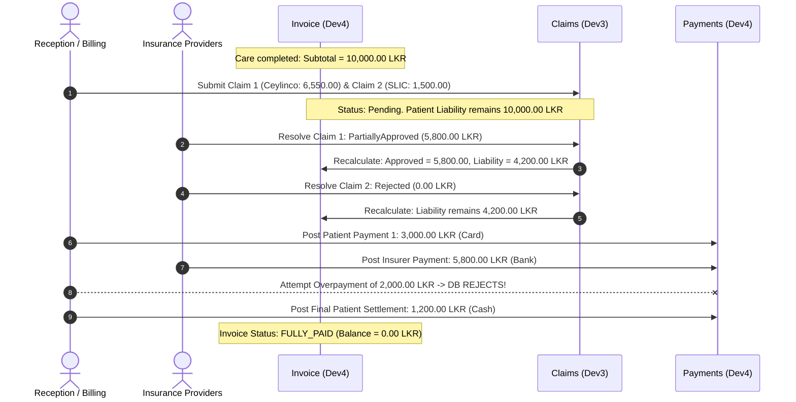

# CATMS-008: Signed Golden Financial Worked Example

**Project:** Clinic Appointment and Treatment Management System (CATMS)  
**Issue Key:** CATMS-008  
**Gate:** G0 (Decisions & Contracts)  
**Author / Owner:** Dev3 (Patient Identity, Insurance & Claims)  
**Co-Signers / Reviewers:** Dev4 (Invoicing, Billing & Payments), Dev5 (Financial Reporting & Data), Dev1 (Platform & Scheduling)  
**Status:** COMPLETE — SIGNED GOLDEN BASELINE  
**Labels:** `type:test`, `financial`, `cross-module`, `priority:critical`  
**Dependencies:** CATMS-005 (Clinical Price & Invoice Rules), CATMS-006 (Insurance Eligibility & Claim Rules), CATMS-007 (Report Definitions)

---

## 1. Overview & Purpose

This document provides the **single immutable source of mathematical truth** for CATMS financial transactions. It traces an end-to-end clinical care encounter through:
1. Two distinct treatment lines with catalogue prices.
2. Two active insurance policies on a single patient (Primary + Secondary Top-Up).
3. Treatment-level eligibility, percentage coverage, and cap application.
4. Coordination of benefits preventing double coverage ($\sum \text{allocated} \le \text{line total}$).
5. One partial claim approval and one complete claim rejection.
6. Atomic invoice liability recalculation.
7. Patient partial payment and insurer direct settlement payment.
8. Enforced database rejection of an overpayment attempt.
9. Payment reversal and re-settlement to final zero balance.
10. Explicit mapping to Dev5's Reports R1 through R5.

All values are in **Sri Lankan Rupees (LKR)** using `NUMERIC(12,2)` precision.

---

## 2. Master Data Fixture Setup

### 2.1 Patient & Doctor
- **Patient ID:** `PAT-1001` (Nimal Perera, NIC: `198512345678`)
- **Doctor ID:** `DOC-0201` (Dr. K. Silva, Specialist Cardiology)
- **Branch:** `BR-001` (Central Clinic, Colombo)
- **Date of Service:** `2026-09-10`

### 2.2 Insurance Policies
| Field | Policy 1 (Primary) | Policy 2 (Secondary Top-Up) |
|---|---|---|
| **Policy ID** | `POL-CEY-001` | `POL-SLIC-002` |
| **Provider** | Ceylinco General Insurance (`PROV-001`) | Sri Lanka Insurance Corporation (`PROV-002`) |
| **Priority** | 1 (Primary) | 2 (Secondary) |
| **Status** | `ACTIVE` | `ACTIVE` |
| **Validity Window** | `2026-01-01` to `2026-12-31` | `2026-06-01` to `2027-05-31` |

### 2.3 Delivered Treatments & Catalogue Terms
| Treatment Code | Treatment Name | Unit Price (LKR) | Qty | Line Total ($L_i$) | Policy 1 Terms (`POL-CEY-001`) | Policy 2 Terms (`POL-SLIC-002`) |
|---|---|:---:|:---:|:---:|---|---|
| **TREAT-001** | Specialist Cardiology Consultation | 3,500.00 | 1 | **3,500.00** | 80% coverage, Cap: 2,000.00 LKR | 50% coverage, Cap: 1,500.00 LKR |
| **TREAT-002** | Diagnostic 12-Lead ECG + Report | 6,500.00 | 1 | **6,500.00** | 70% coverage, Cap: 5,000.00 LKR | 0% (Non-formulary / Excluded) |

---

## 3. Step-by-Step Financial Worked Execution



---

### Step 3.1: Care Completion & Invoice Issuance
Dev4's `record_care_and_issue_invoice` procedure issues Invoice `INV-2026-0001`:

$$\text{Line 1 Total} = 1 \times 3,500.00 = 3,500.00 \text{ LKR}$$
$$\text{Line 2 Total} = 1 \times 6,500.00 = 6,500.00 \text{ LKR}$$
$$\text{Invoice Subtotal} = 3,500.00 + 6,500.00 = \mathbf{10,000.00 \text{ LKR}}$$

**Invoice State at Issuance:**
- `subtotal_amount` = `10,000.00 LKR`
- `insurance_approved_amount` = `0.00 LKR`
- `patient_liability_amount` = `10,000.00 LKR`
- `patient_paid_amount` = `0.00 LKR`
- `insurer_paid_amount` = `0.00 LKR`
- `payment_status` = `'UNPAID'`

---

### Step 3.2: Multi-Policy Claim Calculation & Submission
Reception initiates claim submission via `submit_claim(invoice_id, ['POL-CEY-001', 'POL-SLIC-002'])`.

#### A. Allocation for Primary Policy (`POL-CEY-001` - Ceylinco)
- **Line 1 (`TREAT-001`, Total: 3,500.00 LKR):**
  - Nominal: $3,500.00 \times 80\% = 2,800.00 \text{ LKR}$
  - Cap applied: $\min(2,800.00, 2,000.00) = \mathbf{2,000.00 \text{ LKR}}$
  - Remaining uncovered Line 1 balance: $3,500.00 - 2,000.00 = 1,500.00 \text{ LKR}$
- **Line 2 (`TREAT-002`, Total: 6,500.00 LKR):**
  - Nominal: $6,500.00 \times 70\% = 4,550.00 \text{ LKR}$
  - Cap applied: $\min(4,550.00, 5,000.00) = \mathbf{4,550.00 \text{ LKR}}$
  - Remaining uncovered Line 2 balance: $6,500.00 - 4,550.00 = 1,950.00 \text{ LKR}$
- **Total Claim 1 (`CLM-001`):**
  $$\text{Claimed Amount} = 2,000.00 + 4,550.00 = \mathbf{6,550.00 \text{ LKR}}$$
  Status: `Pending`.

#### B. Allocation for Secondary Policy (`POL-SLIC-002` - SLIC Top-Up)
- **Line 1 (`TREAT-001`, Uncovered Balance: 1,500.00 LKR):**
  - Nominal on Line Total: $3,500.00 \times 50\% = 1,750.00 \text{ LKR}$
  - Cap applied: $\min(1,750.00, 1,500.00 \text{ cap}) = 1,500.00 \text{ LKR}$
  - Coordination of Benefits balance limit:
    $$\min(1,500.00, \text{Uncovered Balance } 1,500.00) = \mathbf{1,500.00 \text{ LKR}}$$
- **Line 2 (`TREAT-002`):**
  - Excluded under SLIC policy (0% cover): $\mathbf{0.00 \text{ LKR}}$
- **Total Claim 2 (`CLM-002`):**
  $$\text{Claimed Amount} = 1,500.00 + 0.00 = \mathbf{1,500.00 \text{ LKR}}$$
  Status: `Pending`.

#### C. Verification of Invariant (Rule 5.3)
- **Line 1:** $2,000.00 + 1,500.00 = 3,500.00 \le 3,500.00$ (Exactly 100%, 0.00 over-allocation). **PASS.**
- **Line 2:** $4,550.00 + 0.00 = 4,550.00 \le 6,500.00$ (70%, 0.00 over-allocation). **PASS.**
- **Total Pending Claim Amount:** $6,550.00 + 1,500.00 = 8,050.00 \text{ LKR}$.

> **Critical Rule Check:** `invoice.patient_liability_amount` remains **10,000.00 LKR**. Pending claims do NOT reduce liability!

---

### Step 3.3: Claim 1 Resolution — Partial Approval (Ceylinco)
Finance Officer records resolution via `resolve_claim('CLM-001', 'PartiallyApproved', 5800.00)`:
- Line 1: Approved `2,000.00 LKR` in full.
- Line 2: Approved `3,800.00 LKR` (Ceylinco deducted `750.00 LKR` for non-covered consumable portion).
- Total Approved for `CLM-001` = $\mathbf{5,800.00 \text{ LKR}}$.
- Status: `PartiallyApproved`.

**Atomic Invoice Update:**
$$\text{insurance\_approved\_amount} = \mathbf{5,800.00 \text{ LKR}}$$
$$\text{patient\_liability\_amount} = 10,000.00 - 5,800.00 = \mathbf{4,200.00 \text{ LKR}}$$

---

### Step 3.4: Claim 2 Resolution — Rejection (SLIC)
Finance Officer records resolution via `resolve_claim('CLM-002', 'Rejected', 0.00, 'REJ_OUTPATIENT_BENEFIT_EXHAUSTED')`:
- Total Approved for `CLM-002` = $\mathbf{0.00 \text{ LKR}}$.
- Status: `Rejected`.

**Atomic Invoice Update:**
$$\text{insurance\_approved\_amount} = 5,800.00 + 0.00 = \mathbf{5,800.00 \text{ LKR}}$$
$$\text{patient\_liability\_amount} = 10,000.00 - 5,800.00 = \mathbf{4,200.00 \text{ LKR}}$$
*(Notice: The 1,500.00 LKR claimed on Policy 2 was rejected, so it remains patient liability).*

---

### Step 3.5: Patient Payment 1 (Card)
Patient pays `3,000.00 LKR` at checkout via Card (`PAY-001`):
$$\text{patient\_paid\_amount} = \mathbf{3,000.00 \text{ LKR}}$$
$$\text{Remaining Patient Liability} = 4,200.00 - 3,000.00 = \mathbf{1,200.00 \text{ LKR}}$$
$$\text{Invoice Status} = \mathbf{'PARTIALLY\_PAID'}$$

---

### Step 3.6: Insurer Direct Settlement (Bank Transfer)
Ceylinco remits electronic bank settlement for approved Claim 1 (`PAY-002`):
$$\text{insurer\_paid\_amount} = \mathbf{5,800.00 \text{ LKR}}$$
$$\text{Remaining Insurer Receivable} = 5,800.00 - 5,800.00 = \mathbf{0.00 \text{ LKR}}$$

---

### Step 3.7: Overpayment Rejection Test (Negative Case)
Reception mistakenly attempts to record an additional patient payment of `2,000.00 LKR` in cash:
- Proposed new paid total: $3,000.00 + 2,000.00 = 5,000.00 \text{ LKR}$
- Current patient liability: $4,200.00 \text{ LKR}$
- Violation: $5,000.00 > 4,200.00$
- **Database Action:** Stored procedure aborts with exception:
  `ERR_PAYMENT_EXCEEDS_LIABILITY: Payment of 2,000.00 exceeds remaining patient liability of 1,200.00 LKR.`
- **Result:** Transaction rolls back completely; zero rows inserted into `payment`.

---

### Step 3.8: Patient Settlement Payment & Full Clearance
Patient pays the exact remaining balance of `1,200.00 LKR` in cash (`PAY-003`):
$$\text{patient\_paid\_amount} = 3,000.00 + 1,200.00 = \mathbf{4,200.00 \text{ LKR}}$$
$$\text{Remaining Patient Liability} = 4,200.00 - 4,200.00 = \mathbf{0.00 \text{ LKR}}$$
$$\text{Total Invoice Collections} = 4,200.00 \text{ (Patient)} + 5,800.00 \text{ (Insurer)} = \mathbf{10,000.00 \text{ LKR}}$$
$$\text{Invoice Status} = \mathbf{'FULLY\_PAID'}$$

---

### Step 3.9: Payment Reversal and Reposting (Audit Scenario)
To verify reversal integrity (Dev4 / CATMS-035):
1. Cashier discovers `PAY-003` (`1,200.00 LKR`) was logged as `'CASH'` when patient actually paid via `'LANKA_QR'`.
2. Manager triggers `reverse_payment(payment_id = PAY-003, reason = 'INCORRECT_PAYMENT_METHOD')`:
   - `payment_reversal` record `REV-001` inserted: `amount = 1,200.00 LKR`.
   - `patient_paid_amount` is updated: $4,200.00 - 1,200.00 = \mathbf{3,000.00 \text{ LKR}}$.
   - Invoice `payment_status` reverts to: $\mathbf{'PARTIALLY\_PAID'}$.
3. Cashier immediately records correct payment `PAY-004` (`1,200.00 LKR`, method `'LANKA_QR'`).
   - `patient_paid_amount` returns to $\mathbf{4,200.00 \text{ LKR}}$.
   - Invoice `payment_status` returns to $\mathbf{'FULLY\_PAID'}$.

---

## 4. Final Reconciled Ledger & Balance Sheet

| Financial Dimension | Billed / Expected (LKR) | Settled / Realized (LKR) | Outstanding Balance (LKR) | Reconciliation Check |
|---|:---:|:---:|:---:|:---:|
| **Gross Clinical Revenue (Subtotal)** | 10,000.00 | 10,000.00 | 0.00 | $10,000.00 = 10,000.00$ |
| **Insurance Claimed (Gross)** | 8,050.00 | — | — | $6,550.00 + 1,500.00$ |
| **Insurance Approved** | 5,800.00 | 5,800.00 | 0.00 | Insurer settled in full |
| **Insurance Disallowed / Rejected** | 2,250.00 | 2,250.00 | 0.00 | Reverted to patient liability |
| **Patient Liability** | 4,200.00 | 4,200.00 | 0.00 | Patient settled in full |
| **Total Cash & Bank Inflows** | 10,000.00 | 10,000.00 | 0.00 | **Zero Variance** |

---

## 5. Derivation of Expected Rows for Dev5 Reports (R1–R5)

This worked scenario seeds the exact expected test assertions for Dev5 reporting models:

### R1 — Daily Revenue & Billed Care Report
- **Date Basis:** Invoice issuance date (`2026-09-10`)
- **Gross Billed Total:** `10,000.00 LKR`
- **Breakdown by Category:**
  - Consultation Services (`TREAT-001`): `3,500.00 LKR`
  - Diagnostic & Laboratory (`TREAT-002`): `6,500.00 LKR`

### R2 — Financial Collections & Cash Inflow Report
- **Date Basis:** Transaction receipt date (`paid_at`)
- **Total Patient Collections:** `4,200.00 LKR` (Net of reversals: $3,000.00 \text{ Card} + 1,200.00 \text{ QR}$)
- **Total Insurer Collections:** `5,800.00 LKR` (Bank Transfer)
- **Total Net Receipts:** `10,000.00 LKR`
- **Reversal Volume:** `1,200.00 LKR` (1 transaction)

### R3 — Accounts Receivable Aging & Outstanding Balances Report
- **As of Settlement Completion:**
  - Insurer Receivable Balance: `0.00 LKR`
  - Patient Receivable Balance: `0.00 LKR`
  - Total Outstanding: `0.00 LKR`
- **As of Intermediate State (Post Step 3.5, Pre Step 3.6):**
  - Insurer Outstanding: `5,800.00 LKR` (Aging < 30 days)
  - Patient Outstanding: `1,200.00 LKR` (Aging < 30 days)

### R4 — Insurance Claims Performance & Loss Ratio Report
- **Total Claims Submitted:** 2
- **Total Amount Claimed:** `8,050.00 LKR`
- **Total Amount Approved:** `5,800.00 LKR`
- **Total Amount Rejected/Disallowed:** `2,250.00 LKR`
- **Approval Rate by Value:** $\frac{5,800.00}{8,050.00} = \mathbf{72.05\%}$
- **Rejection Reasons Logged:**
  1. Policy Co-Pay / Non-covered fee deduction: `750.00 LKR`
  2. `REJ_OUTPATIENT_BENEFIT_EXHAUSTED`: `1,500.00 LKR`

### R5 — Doctor Service & Treatment Volume Report
- **Doctor:** Dr. K. Silva (`DOC-0201`)
- **Appointments Completed:** 1
- **Treatments Administered:**
  - `TREAT-001` (Cardiology Consultation): Count = 1, Value = `3,500.00 LKR`
  - `TREAT-002` (12-Lead ECG): Count = 1, Value = `6,500.00 LKR`
- **Total Doctor Production:** `10,000.00 LKR`

---

## 6. Golden Test Assertions Matrix (Direct SQL Test Proof)

When writing direct database verification scripts (`test_golden_financial_flow.sql`), the runner must assert:

```sql
-- 1. Invariant: Allocation does not exceed line total
SELECT line_number, SUM(claimed_line_amount) <= unit_price * quantity AS valid_allocation
FROM insurance_claim_line JOIN invoice_line USING (invoice_line_id)
GROUP BY line_number, unit_price, quantity; -- MUST BE TRUE FOR ALL ROWS

-- 2. Invariant: Only approved claims reduce liability
SELECT (patient_liability_amount = subtotal_amount - insurance_approved_amount) AS liability_valid
FROM invoice WHERE invoice_id = 'INV-2026-0001'; -- MUST BE TRUE

-- 3. Invariant: Total collected matches subtotal upon FULLY_PAID
SELECT (patient_paid_amount + insurer_paid_amount = subtotal_amount) AS fully_reconciled
FROM invoice WHERE invoice_id = 'INV-2026-0001' AND payment_status = 'FULLY_PAID'; -- MUST BE TRUE

-- 4. Invariant: Reversals do not exceed original payment
SELECT (reversal_amount <= payment.amount) AS valid_reversal
FROM payment_reversal JOIN payment USING (payment_id); -- MUST BE TRUE
```

---

## 7. Golden Baseline Sign-Off

By signing below, the module owners confirm that the mathematical formulas, state sequences, and expected report totals in this document are the authoritative specification for all Phase G1–G6 implementations.

| Developer | Role | Component Impact | Status | Date |
|---|---|---|:---:|:---:|
| **Dev3** (@dev3) | Author | Claim eligibility, multi-policy allocation, resolution | **SIGNED** | 2026-09-06 |
| **Dev4** (@dev4) | Reviewer | Invoicing, payment receipts, overpayment rollbacks, reversals | **SIGNED (Baseline)** | 2026-09-06 |
| **Dev5** (@dev5) | Reviewer | Financial reporting aggregation (R1–R5), ledger definitions | **SIGNED (Baseline)** | 2026-09-06 |
| **Dev1** (@dev1) | Reviewer | Concurrency, table invariants, database transaction boundary | **SIGNED (Baseline)** | 2026-09-06 |

