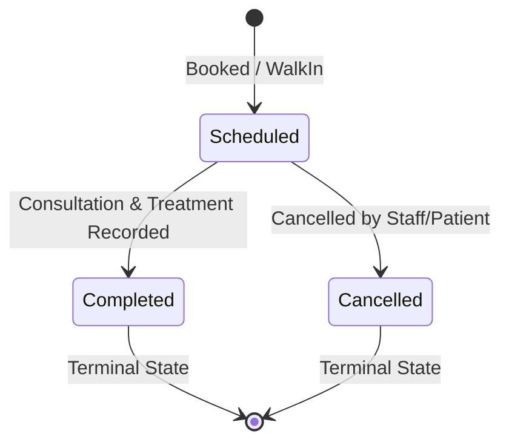

# ADR-004: Appointment & Scheduling Rules, Overlap Semantics, and Time Boundaries

* **Date:** 2026-09-03
* **Status:** Accepted
* **Deciders:** Dev1 (Lead/Scheduling), Dev2 (Staff/Access), Dev4 (Clinical/Billing)
* **CATMS Issue:** `CATMS-004`
* **SRS Reference:** `REQ-11` through `REQ-17`, `BR-01`, `BR-02`

---

## Context

Double-booking doctors or allowing invalid schedule overlaps undermines clinic operations and breaches a core system invariant (`REQ-14`). Application-level checks alone are vulnerable to race conditions under concurrent requests. The scheduling engine must enforce overlap exclusion at the database level using PostgreSQL GiST constraints, establish unambiguous interval semantics, define 15-minute slot alignment, and maintain immutable audit histories for schedule and status transitions.

---

## Decision

### 1. GiST Exclusion Constraint & Overlap Semantics

Double-booking prevention is enforced natively in PostgreSQL 16 using the `btree_gist` extension.

```sql
-- Half-open interval definition: [start_at, end_at)
ALTER TABLE appointment
ADD CONSTRAINT ex_appointment_doctor_time_no_overlap
EXCLUDE USING gist (
    doctor_id WITH =,
    tstzrange(start_at, end_at, '[)') WITH &&
)
WHERE (status != 'Cancelled');
```

#### Interval Rules
* **Half-open Interval `[start_at, end_at)`:** The appointment includes `start_at` up to but strictly excluding `end_at`.
* **Adjacent Slots Allowed:** An appointment from `10:00` to `10:30` and a second appointment from `10:30` to `11:00` share the boundary timestamp `10:30` but do **not** overlap. They are valid and accepted.
* **Partial / Full Overlaps Rejected:** Any attempt to insert or update an appointment where `[start_at, end_at)` intersects an existing non-cancelled appointment for the same doctor triggers a PostgreSQL `exclusion_violation` (`SQLSTATE 23P01`).

---

### 2. Time Grid Boundaries & Validity Rules

* **15-Minute Grid Alignment:** Appointment start times and end times must align to 15-minute boundaries (00, 15, 30, 45 minutes).
  ```sql
  CHECK (EXTRACT(MINUTE FROM start_at)::INTEGER % 15 = 0)
  CHECK (EXTRACT(MINUTE FROM end_at)::INTEGER % 15 = 0)
  ```
* **Positive Duration:** `end_at` must be strictly after `start_at`:
  ```sql
  CHECK (end_at > start_at)
  ```
* **Doctor Availability Verification:** Before booking, the requested time must fall within the doctor's active recurring schedule (`doctor_availability`) or an `ExtraHours` exception (`doctor_availability_exception`), and must not fall within an `Unavailable` exception.
* **Timezone Rules:** All timestamps (`start_at`, `end_at`, `created_at`) are stored in **UTC** as `TIMESTAMPTZ`. UI rendering and daily reporting filters convert UTC to Sri Lanka Standard Time (`Asia/Colombo`, UTC+5:30).

---

### 3. Appointment State Machine



#### Booking Types vs. Status
* **Booking Type (`booking_type`):** Distinguishes `Booked` (advance reservation) from `WalkIn` (same-day arrival).
* **Appointment Status (`status`):** Tracks lifecycle progression: `Scheduled`, `Completed`, `Cancelled`.
* **Terminal States:** `Completed` and `Cancelled` are immutable terminal states. A completed appointment cannot be cancelled or rescheduled; a cancelled appointment cannot be reopened or completed.

---

### 4. Audit History Requirements

Every schedule or status change produces immutable audit records:
1. **Rescheduling (`appointment_schedule_history`):** Captures `old_start_at`, `old_end_at`, `new_start_at`, `new_end_at`, `reason`, `changed_by_employee_id`, and `changed_at`.
2. **Status Changes (`appointment_status_log`):** Captures `old_status`, `new_status`, `reason`, `changed_by_employee_id`, and `changed_at`.

Direct updates or deletes on these audit history tables are forbidden by database privilege revocation.

---

## Consequences

* **Positive:** Natively prevents race-condition double bookings under concurrent booking attempts without explicit row locking (`FOR UPDATE`).
* **Negative:** Requires PostgreSQL `btree_gist` extension to be enabled in migration `001`.
